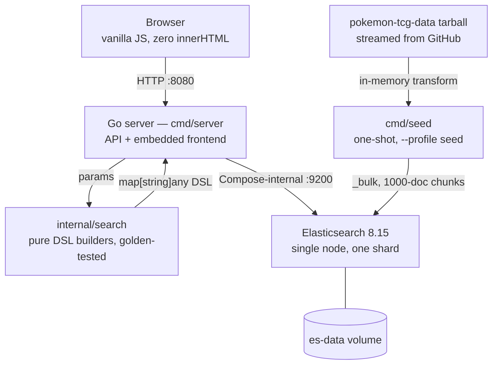

# Pokesearch

[](https://github.com/AndresThePerez/PokeSearch/actions/workflows/ci.yml)
[](go.mod)
[](LICENSE)

Pokesearch is a fast search engine over 20,324 English Pokémon TCG cards: a Go API, Elasticsearch relevance and facets, and an embedded vanilla-JavaScript gallery in one containerized binary. Its signature feature is the observability rail — every search shows you the exact Elasticsearch DSL that answered it, the cluster's latency, the browser round trip, and the live SLA targets, while writing that same query to the application log as one replayable JSON line.


## Quick start

```bash
docker compose up -d --build
docker compose --profile seed run --rm seed
curl -s http://localhost:8080/healthz
```

Open <http://localhost:8080>. The first seed streams the source tarball through memory and indexes 20,324 cards; it never writes them to disk. Elasticsearch stays private to the Compose network — only the application is published.

Publish on a different host port with `APP_PORT`:

```bash
APP_PORT=8081 docker compose up -d --build
```


## Development

The Go server defaults to `PORT=8080` and `ES_URL=http://127.0.0.1:9200`. Opt into a host-published development Elasticsearch with:

```bash
docker compose -f docker-compose.yml -f docker-compose.dev.yml up -d es
go run ./cmd/seed
PORT=8080 go run ./cmd/server
```

The seed command accepts:

- `-es URL` — Elasticsearch URL.
- `-ref REF` — `AndresThePerez/pokemon-tcg-data` Git ref; defaults to `master`. Pin a commit SHA when a reproducible corpus snapshot matters.
- `-force` — delete and recreate a populated `cards` index.

Run the checks the CI workflow runs:

```bash
go build ./...
go vet ./...
go vet -tags acceptance ./internal/acceptance
go test -race ./...
golangci-lint run ./...
go run golang.org/x/vuln/cmd/govulncheck@latest ./...
node --check web/app.js
```

The acceptance suite is build-tagged and runs against a live stack:

```bash
POKESEARCH_URL=http://localhost:8080 go test -tags acceptance -count=1 ./internal/acceptance
```

### Build identity

Builds are stamped through `-ldflags` and reported by `/api/meta`. An unstamped build honestly reports `dev` / `none` / `unknown` rather than a misleading version:

```bash
VERSION=$(git describe --tags --always) \
COMMIT=$(git rev-parse --short HEAD) \
BUILT=$(date -u +%FT%TZ) \
docker compose up -d --build
```

## API

| Endpoint | Purpose | Parameters |
|---|---|---|
| `GET /livez` | Liveness only — never touches Elasticsearch. Container healthcheck target. | — |
| `GET /healthz` | Elasticsearch reachability and indexed document count | — |
| `GET /api/meta` | Build identity and corpus provenance | — |
| `GET /api/search` | Fuzzy multi-field card search, filters, facets, sorting, pagination | `q`, `id`, `supertype`, `types`, `set`, `rarity`, `series`, `hp_min`, `hp_max`, `sort`, `order`, `page`, `page_size`, `debug=1` |
| `GET /api/suggest` | Deduplicated card-name completion with a fuzzy retry | `q` |
| `GET /debug/vars` | expvar counters. **Opt-in** — only exists when `METRICS=1` | — |

Search responses carry Elasticsearch's `took_ms`, the effective `page_size`, and live `supertype`, `types`, `rarity`, `set_series`, and readable `sets` facets. The `set` parameter takes an exact set ID; combine it with `q` to search within that set. Add `debug=1` to receive the generated DSL in the response.

`GET /healthz` returns `{"docs":N,"status":"ok"}`. Its shape and its Elasticsearch round-trip are a **frozen contract** — use `/livez` for cheap liveness.

`GET /api/meta` returns build identity plus corpus provenance:

```json
{
  "version": "v1.3.0",
  "commit": "4581829",
  "built": "2026-08-22T19:21:13Z",
  "docs": 20324,
  "seed": { "ref": "0af6250a22495e4a3e9f60ff45fc3fedc2e0563d", "seeded_at": "2026-08-22T19:40:00Z" },
  "request_id": "3f2a8c1d9e0b4a76"
}
```

`seed` is `null` for an index seeded before provenance stamping existed. That is reported, not repaired: the stamp appears on the index's next reseed.

### Relevance design

A text query becomes four scored `should` branches. The boosts encode an intended *ordering* — exact beats prefix beats typo beats card text — rather than measured weights:

| Branch | Query | Boost | What it is for |
|---|---|---|---|
| `exact` | `term` on `name.kw` | **8** | An exact name always wins. Searching "Pikachu" must not rank a Pikachu-adjacent card first. |
| `prefix` | `multi_match` `bool_prefix` over `name.sayt` + 2/3-grams | **4** | Instant as-you-type matching, so partial names still rank highly. |
| `fuzzy-name` | `match` on `name`, `fuzziness: AUTO` | **3** | Typo tolerance — "pikuchu" finds Pikachu — ranked below a real prefix match. |
| `text` | `multi_match` `best_fields` over attack/ability names and text, flavor text, set name, artist | *implicit 1* | Discovery through card text: "flip a coin" finds cards by what they do. |

Filters (`supertype`, `types`, `rarity`, `set_series`, `set_id`, HP range) are scoring-neutral. With `q` empty there is nothing meaningful to score, so browse mode sorts by release date instead — match-all scores are noise. Every sort appends ascending card ID as a deterministic tiebreaker, which is what keeps page boundaries stable.

Facets are **disjunctive**: each one is computed with every active filter *except its own*, so selecting `Rare` does not collapse the rarity dropdown to `Rare`, and the count next to an option predicts what clicking it will do. See [ADR 3](docs/DECISIONS.md#adr-3--disjunctive-facets-via-post_filter).

### Paging

`page_size` is bounded **1–100** and defaults to **24**. Pagination is capped at a reachable window of **9,600 documents** so `from + size` always stays inside Elasticsearch's 10,000-result window:

```text
pages = ceil(min(total, 9600) / page_size)
```

`pages` is therefore deliberately **not** `total / page_size` on large result sets: a browse of all 20,324 cards reports `pages: 400` at the default size, `96` at `page_size=100`, and `9600` at `page_size=1`. Out-of-range values clamp rather than fail — `page_size=500` becomes `100`, `page=999999` becomes the last reachable page.

### Errors

Every non-2xx response uses one shape:

```json
{
  "error": { "code": "invalid_param", "field": "sort", "message": "sort must be one of relevance|newest|oldest|hp|name" },
  "request_id": "3f2a8c1d9e0b4a76"
}
```

| Code | Status | Meaning |
|---|---|---|
| `invalid_param` | `400` | A strict parameter was supplied with an invalid value. `field` names it. |
| `es_unavailable` | `503` | Elasticsearch could not be reached or returned an error. The cause — including a truncated Elasticsearch error body — goes to the log, never to the client. |

Parameters split into two groups:

| Behaviour | Parameters | On invalid input |
|---|---|---|
| **Strict** | `sort`, `order`, `supertype`, `hp_min`, `hp_max`, `page`, `page_size` | `400` with the offending `field`. Rejected before Elasticsearch is called. |
| **Lenient** | members of the `types`, `rarity`, and `series` comma-lists; unknown query keys | Silently dropped/ignored, `200`. |

Out-of-range integers are clamped, not rejected — a clamp is a contract, an alphabetic `page` is a typo. `GET /api/suggest` reads only `q`, so field errors on its other parameters are ignored rather than returned. The rationale is [ADR 7](docs/DECISIONS.md#adr-7--a-strictlenient-error-contract).

### Type names

The API and index retain the source dataset's canonical TCG type values. The interface presents `Metal` as **Steel** and `Colorless` as **Normal**, including filter labels, active-filter chips, attack costs, and card details.

### Card images

Card art is served from `images.scrydex.com`. The seeder rewrites the source dataset's legacy `images.pokemontcg.io` URLs to Scrydex card-ID routes, because the original URLs return real 404s. This is a hard third-party dependency: if Scrydex is unavailable, art fails to load while search itself continues to work.

## Observability

Every request gets an ID and leaves a trail that connects the browser to the log:

- **`X-Request-Id` on every response.** An inbound `X-Request-Id` or Cloudflare `Cf-Ray` is honoured so one trace spans edge, app and client; otherwise one is generated. An inbound value that does not look like a trace ID is replaced rather than sanitized — it ends up in a response header and in every log line.
- **One access line per request:** `method`, `path`, `status`, `bytes`, `dur_ms`, `request_id`.
- **One query line per search or suggestion** that reaches Elasticsearch, carrying the full generated DSL — the same JSON the UI's inspector shows. Both lines are JSON, both use UTC millisecond timestamps, and both name the same `request_id`, so correlating them never involves reasoning about time zones.
- **`METRICS=1`** publishes stdlib `expvar` counters at `/debug/vars`, keyed by route and status (`search_200`, `search_400`, …). Counting is always on; publishing is opt-in, because the production tunnel forwards whatever path it is given. **Never set `METRICS=1` in the server topology.**

## Architecture



```text
browser :8080
     │
     ▼
Go server ── embedded HTML/CSS/JS
     │
     │ Compose-internal HTTP :9200
     ▼
Elasticsearch 8.15 ── es-data volume
     ▲
     │ one-shot /seed profile
pokemon-tcg-data tarball (streamed from GitHub)
```

The production Compose topology publishes only the Go application. `docker-compose.dev.yml` is deliberately opt-in so a plain `docker compose up` never exposes Elasticsearch on the host.

The runtime image is `gcr.io/distroless/static-debian12:nonroot` — no shell, no package manager, running as uid 65532, with both base images pinned by digest. Because there is no shell, the server binary is its own healthcheck client (`/server -ping`).

**Why any of this is the way it is:** [docs/DECISIONS.md](docs/DECISIONS.md).

## Deployment

The stack is deployed by pulling the repository onto a host and building there. Substitute your own values:

| Variable | Example | Meaning |
|---|---|---|
| `DEPLOY_HOST` | `user@server` | SSH target running Docker |
| `DEPLOY_DIR` | `~/apps/pokesearch` | Checkout location on that host |
| `APP_PORT` | `8083` | Host port to publish the application on |
| `SEED_REF` | `0af6250a…` | `pokemon-tcg-data` commit to index |

```bash
ssh "$DEPLOY_HOST"
cd "$DEPLOY_DIR"
git pull
printf 'APP_PORT=%s\n' "$APP_PORT" > .env      # git-ignored
docker compose -f docker-compose.yml -f docker-compose.server.yml up -d --build
```

`docker-compose.server.yml` adds `restart: unless-stopped` and memory caps (`es` 1g — twice the 512m JVM heap, per Elastic's container guidance; `app` 256m) so the stack coexists with a host's other tenants. Elasticsearch remains on the Compose-internal network with no host port in any topology.

Never edit the deployed clone in place: commit on a workstation, push, pull on the host.

**Concrete instance.** The public deployment runs on a home server in `~/apps/pokesearch`, published on host port **8083** (8080–8082 are taken by other services) and exposed at `https://pokesearch.andrestheperez.com` through the host's existing Cloudflare Tunnel — one ingress rule above the 404 catch-all. Wildcard DNS already routes the subdomain, so no DNS change is involved. The same tunnel serves other production sites; regression-check them all after any config change.

### Seeding

Seed once per environment, pinned for reproducibility:

```bash
docker compose -f docker-compose.yml -f docker-compose.server.yml --profile seed run --rm seed \
  -es http://es:9200 -ref "$SEED_REF"
```

`0af6250a22495e4a3e9f60ff45fc3fedc2e0563d` is the `pokemon-tcg-data` `master` commit as of 2026-07-10 and yields exactly **20,324** documents (`/healthz` → `{"docs":20324,"status":"ok"}`). It is the ref pinned in `docker-compose.yml`. A populated index makes reseeding a no-op unless `-force` is passed.

### Backup and restore

The index is write-once: one verified backup after seeding is sufficient (no cron). All commands run on the deployment host in `$DEPLOY_DIR`.

Backup (≈30s downtime; the tarball is ~7MB):

```bash
mkdir -p ~/backups
docker compose -f docker-compose.yml -f docker-compose.server.yml stop es
docker run --rm -v pokesearch_es-data:/data -v ~/backups:/out alpine \
  tar czf /out/pokesearch-es-data-$(date +%F).tgz -C /data .
docker compose -f docker-compose.yml -f docker-compose.server.yml start es
```

Restore (into the live volume — stop the stack first):

```bash
docker compose -f docker-compose.yml -f docker-compose.server.yml stop es app
docker run --rm -v pokesearch_es-data:/data -v ~/backups:/in alpine \
  sh -c 'rm -rf /data/* && tar xzf /in/pokesearch-es-data-<DATE>.tgz -C /data'
docker compose -f docker-compose.yml -f docker-compose.server.yml start es app
```

Recovery ladder, cheapest first:

1. **Container restart** — the `es-data` volume persists the index.
2. **Reseed** with the pinned ref (see Seeding above) — deterministic, takes seconds.
3. **Restore** the backup tarball into `pokesearch_es-data` (commands above).
4. **Full rebuild** — re-clone, `up -d --build`, reseed.

Rollback for public exposure: restore the previous `cloudflared` config backup over the live config, restart `cloudflared`, then re-verify every hostname the tunnel serves.

## License

[MIT](LICENSE) © 2026 Andres Perez.

Card data comes from the `pokemon-tcg-data` dataset. Pokémon and all associated names are trademarks of Nintendo, Game Freak and The Pokémon Company; this project is an unaffiliated, non-commercial portfolio piece.
