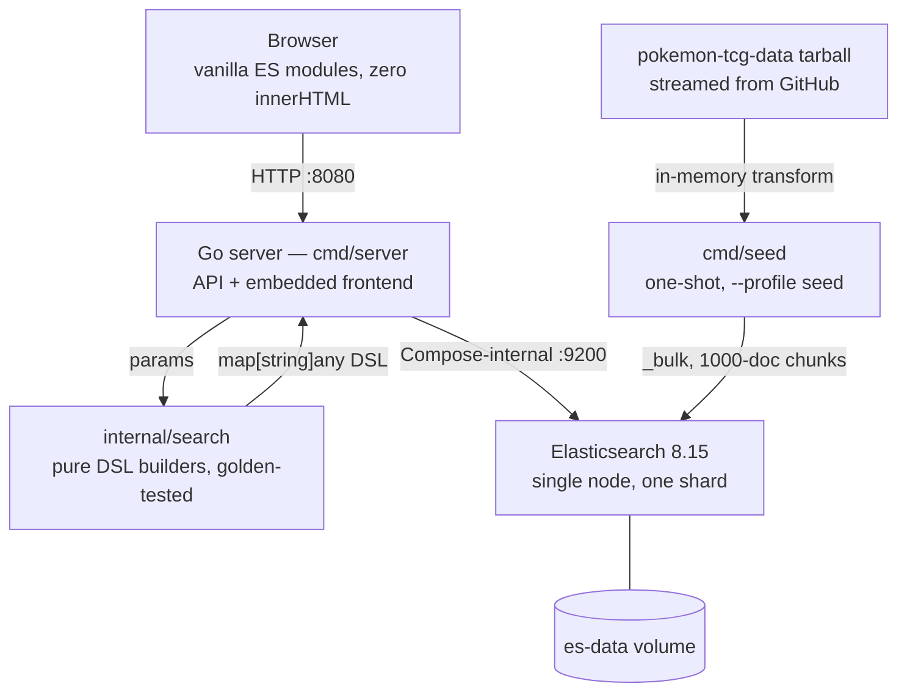

# PokéSearch

[](https://github.com/AndresThePerez/PokeSearch/actions/workflows/ci.yml)
[](go.mod)
[](LICENSE)

### **[Live demo → pokesearch.andrestheperez.com](https://pokesearch.andrestheperez.com)**

PokéSearch is a full-text search engine over all 20,324 English Pokémon TCG cards — a Go API, an Elasticsearch relevance model with disjunctive facets, and a dependency-free ES-module frontend, shipped as a single containerized binary. Searching the corpus is the easy half. The half worth reading the code for is that the engine explains itself.

Every result page carries an observability rail: the exact Elasticsearch DSL that answered the query, the cluster's own latency broken out from the browser round trip, a sparkline of the session's last twenty requests, and the live SLA targets — while the same query goes to the application log as one replayable JSON line tagged with the request ID printed on screen.

Relevance is equally legible. A text query fans into four *named*, boosted `should` branches; Elasticsearch echoes which branches each hit matched, so the grid renders them as per-card badges and the boost hierarchy becomes something you can watch shift down the page. `GET /api/explain` takes it one card deeper through Lucene's `_explain`, and because a `should` query's clauses sum, the modal's score bars add back up to the number the card was ranked by. The treatment generalizes: `#stats` profiles the entire archive in hand-rolled CSS charts and shows the aggregation DSL behind them in the same inspector.


## Quick start

```bash
docker compose up -d --build
docker compose --profile seed run --rm seed
curl -s http://localhost:8080/healthz
```

Open <http://localhost:8080>. The first seed streams the source tarball through memory and indexes 20,324 cards; it never writes them to disk. Elasticsearch stays private to the Compose network — only the application is published.

Publish on a different host port with `APP_PORT`:

```bash
APP_PORT=8081 docker compose up -d --build
```


## Development

The Go server defaults to `PORT=8080` and `ES_URL=http://127.0.0.1:9200`. Opt into a host-published development Elasticsearch with:

```bash
docker compose -f docker-compose.yml -f docker-compose.dev.yml up -d es
go run ./cmd/seed
PORT=8080 go run ./cmd/server
```

`docker-compose.dev.yml` binds Elasticsearch to `127.0.0.1:9200` only — never `0.0.0.0`.

The seed command accepts:

- `-es URL` — Elasticsearch URL. Defaults to `http://127.0.0.1:9200`.
- `-ref REF` — `AndresThePerez/pokemon-tcg-data` Git ref; defaults to `master`. Pin a commit SHA when a reproducible corpus snapshot matters.
- `-force` — delete and recreate a populated `cards` index.
- `-tarball-base URL` — source tarball base; defaults to the dataset's `codeload.github.com` path. Override it to seed from a mirror.

Run the checks the CI workflow runs:

```bash
go build ./...
go vet ./...
go vet -tags acceptance ./internal/acceptance
go test -race ./...
golangci-lint run
go run golang.org/x/vuln/cmd/govulncheck@latest ./...
find web -name '*.js' -exec node --check {} \;
```

CI adds one job this list cannot express locally: it builds the runtime image and asserts via `docker inspect` that it does not run as root.

In full, `.github/workflows/ci.yml` runs three jobs on every pull request and on every push to `master` — a Go job that builds, vets, vets the tag-gated `internal/acceptance` package separately so it cannot stop compiling unnoticed, runs the tests under `-race`, then runs golangci-lint at its pinned `v2.13.1` and `govulncheck` at a pinned version rather than the `@latest` above, so the scanner itself cannot change under CI; the vulnerability database is still fetched at run time, so a newly published advisory can still turn `master` red; a frontend job that runs `node --check` over every shipped `.js` file under `web/` and fails if that glob matches nothing; and the image job just described, whose assertion is stricter than its name — it fails if the configured user is empty as well as if it is `root`.

The acceptance suite is build-tagged and runs against a live stack:

```bash
POKESEARCH_URL=http://localhost:8080 go test -tags acceptance -count=1 ./internal/acceptance
```

`.github/workflows/acceptance.yml` runs that same suite end to end on demand (`workflow_dispatch`): it brings the stack up, seeds the pinned ref, asserts `/healthz` reports exactly 20,324 documents, and only then runs the tests.

### Build identity

Builds are stamped through `-ldflags` and reported by `/api/meta`. An unstamped build honestly reports `dev` / `none` / `unknown` rather than a misleading version:

```bash
VERSION=$(git describe --tags --always) \
COMMIT=$(git rev-parse --short HEAD) \
BUILT=$(date -u +%FT%TZ) \
docker compose up -d --build
```

## API

| Endpoint | Purpose | Parameters |
|---|---|---|
| `GET /` | The embedded frontend, served from `embed.FS` | — |
| `GET /livez` | Liveness only — never touches Elasticsearch. Container healthcheck target. | — |
| `GET /healthz` | Elasticsearch reachability and indexed document count | — |
| `GET /api/meta` | Build identity and corpus provenance | — |
| `GET /api/search` | Fuzzy multi-field card search, filters, facets, sorting, pagination | `q`, `id`, `supertype`, `types`, `set`, `rarity`, `series`, `hp_min`, `hp_max`, `sort`, `order`, `page`, `page_size`, `debug=1` |
| `GET /api/suggest` | Deduplicated card-name completion with a fuzzy retry | `q` |
| `GET /api/explain` | Score anatomy for one card under one query: per-branch contributions | `id`, `q` (both required) |
| `GET /api/compare` | The same query ranked under two named weight profiles: both top-ten windows, the per-card movement and Spearman's ρ over their union | `q` (required), `a`, `b` — profile names from `served` \| `previous` \| `runner-up`, defaulting to `served` and `previous` |
| `GET /api/stats` | Corpus analytics: prints per year, HP distribution, type/class/rarity/series breakdowns, max HP | `debug=1` |
| `GET /debug/vars` | expvar counters. **Opt-in** — only exists when `METRICS=1` | — |

Routes are registered with method-scoped patterns, so a `POST` to a `GET` route returns `405`, not `404`.

Search responses carry Elasticsearch's `took_ms`, the effective `page_size`, and live `supertype`, `types`, `rarity`, `set_series`, and readable `sets` facets. The `set` parameter takes an exact set ID; combine it with `q` to search within that set. Add `debug=1` to receive the generated DSL in the response.

`GET /healthz` returns `{"docs":N,"status":"ok"}`. Its shape and its Elasticsearch round-trip are a **frozen contract** — use `/livez` for cheap liveness.

`GET /api/meta` returns build identity plus corpus provenance:

```json
{
  "version": "v1.3.0",
  "commit": "4581829",
  "built": "2026-08-22T19:21:13Z",
  "docs": 20324,
  "seed": { "ref": "0af6250a22495e4a3e9f60ff45fc3fedc2e0563d", "seeded_at": "2026-08-22T19:40:00Z" },
  "request_id": "3f2a8c1d9e0b4a76"
}
```

`seed` is `null` for an index seeded before provenance stamping existed. That is reported, not repaired: the stamp appears on the index's next reseed.

### Corpus analytics

`GET /api/stats` aggregates the whole archive in a single `size: 0` request — a `date_histogram` of prints per year, a 30-point HP histogram, the four categorical breakdowns (read from the same facet registry the filter rail uses) and the corpus maximum HP. The corpus is immutable between reseeds, so the result is computed on the first request and served from memory afterwards; an empty index is served but never cached, so the first request after a seed heals it without a restart. `took_ms` is therefore the Elasticsearch time of the aggregation that produced the payload, not of the request being answered.

The `#stats` view renders that payload in hand-rolled CSS charts — no charting library — and the observability rail stays attached, so the aggregation DSL is one click away from the numbers it produced:


### Relevance design

A text query becomes four scored `should` branches. The boosts encode an *ordering* — exact beats prefix beats typo beats card text — and a 27-point sweep over the judged set of [ADR 9](docs/DECISIONS.md#adr-9--how-relevance-is-evaluated) kept that ordering while halving two of the sizes inside it. The **Measured** column is what the sweep found, and [ADR 10](docs/DECISIONS.md#adr-10--measured-branch-weights) is the record:

| Branch | Query | Boost | Measured | What it is for |
|---|---|---|---|---|
| `exact` | `term` on `name.kw` | **8** | Inert from 4 to 16 — every metric identical to the last digit, so the sweep gives no reason to move it | An exact name always wins. Searching "Pikachu" must not rank a Pikachu-adjacent card first. |
| `prefix` | `multi_match` `bool_prefix` over `name.sayt` + 2/3-grams | **2** | Swept over 2 / 4 / 8; **2** won, halving the old 4 | Instant as-you-type matching, so partial names still rank highly. |
| `fuzzy-name` | `match` on `name`, `fuzziness: AUTO` | **1.5** | Swept over 1.5 / 3 / 6; **1.5** won, halving the old 3 | Typo tolerance — "pikuchu" finds Pikachu — ranked below a real prefix match. |
| `text` | `multi_match` `best_fields` over attack/ability names and text, flavor text, set name, artist | *implicit 1* | Not swept — it is the unit the other three are ratios of, so moving it would only rescale them | Discovery through card text: "flip a coin" finds cards by what they do. |

The numbers behind that column — the metric table overall and per stratum, where the judgments came from, the queries the adopted weights moved, and the command that reproduces the run — are published in [docs/RELEVANCE.md](docs/RELEVANCE.md).

The rest of that design — the branch badges and `GET /api/explain`, highlighting and `did_you_mean`, scoring-neutral filters and disjunctive facets, the stock-BM25 and analysis-chain reasoning, and the measured shadow-analyzer index of [ADR 11](docs/DECISIONS.md#adr-11--a-shadow-analyzer-index-measured-not-adopted) — moved to [docs/RELEVANCE.md](docs/RELEVANCE.md) under *Design notes moved from the README*.

### Paging

`page_size` is bounded **1–100** and defaults to **24**. Pagination is capped at a reachable window of **9,600 documents** so `from + size` always stays inside Elasticsearch's 10,000-result window:

```text
pages = ceil(min(total, 9600) / page_size)
```

`pages` is therefore deliberately **not** `total / page_size` on large result sets: a browse of all 20,324 cards reports `pages: 400` at the default size, `96` at `page_size=100`, and `9600` at `page_size=1`. Out-of-range values clamp rather than fail — `page_size=500` becomes `100`, `page=999999` becomes the last reachable page.

### Errors

Every non-2xx **JSON API** response uses one shape: an `error` object carrying `code`, the offending `field` where there is one, and a `message`, beside the request's `request_id`. The example body and the reasoning behind the contract are [ADR 7](docs/DECISIONS.md#adr-7--a-strictlenient-error-contract).

| Code | Status | Meaning |
|---|---|---|
| `invalid_param` | `400` | A strict parameter was supplied with an invalid value, or a required one (`/api/explain`'s `id` and `q`) was omitted. `field` names it. |
| `es_unavailable` | `503` | Elasticsearch could not be reached or returned an error. The cause — including a truncated Elasticsearch error body — goes to the log, never to the client. |

Parameters split into two groups:

| Behaviour | Parameters | On invalid input |
|---|---|---|
| **Strict** | `sort`, `order`, `supertype`, `hp_min`, `hp_max`, `page`, `page_size` | `400` with the offending `field`. Rejected before Elasticsearch is called. |
| **Lenient** | members of the `types`, `rarity`, and `series` comma-lists; unknown query keys | Silently dropped/ignored, `200`. |

Out-of-range integers are clamped, not rejected — a clamp is a contract, an alphabetic `page` is a typo. `GET /api/suggest` reads only `q`, so field errors on its other parameters are ignored rather than returned. The two responses that sit outside the envelope by design, and the uneven case handling across the `rarity` and `series` filters, moved into [ADR 7](docs/DECISIONS.md#adr-7--a-strictlenient-error-contract) with the rest of the rationale.

### Type names

The API and index retain the source dataset's canonical TCG type values. The interface presents `Metal` as **Steel** and `Colorless` as **Normal**, including filter labels, active-filter chips, attack costs, card details, and the `#stats` chart labels.

### Card images

Card art is served from `images.scrydex.com`. The index and the API keep the source dataset's original `images.pokemontcg.io` URLs verbatim; the **frontend** rewrites them to Scrydex card-ID routes at render time, because the original URLs return real 404s. Keeping the rewrite at the presentation layer means the stored documents stay faithful to their source and a future art host is a one-function change. This is a hard third-party dependency: if Scrydex is unavailable, art fails to load while search itself continues to work.

## Observability

Every request gets an ID and leaves a trail that connects the browser to the log:

- **`X-Request-Id` on every response.** An inbound `X-Request-Id` or Cloudflare `Cf-Ray` is honoured so one trace spans edge, app and client; otherwise one is generated. An inbound value that does not look like a trace ID is replaced rather than sanitized — it ends up in a response header and in every log line.
- **One access line per request:** `method`, `path`, `status`, `bytes`, `dur_ms`, `request_id`.
- **One query line per search or suggestion** that reaches Elasticsearch, carrying the full generated DSL — the same query the UI's inspector shows. Both lines are JSON, both use UTC millisecond timestamps, and both name the same `request_id`, so correlating them never involves reasoning about time zones.
- **`METRICS=1`** publishes stdlib `expvar` counters at `/debug/vars`, keyed by route and status (`search_200`, `search_400`, …). Counting is always on; publishing is opt-in, because the production reverse proxy forwards whatever path it is given. **Never set `METRICS=1` in the server topology.**

**[Courier](https://github.com/AndresThePerez/Courier)** — the companion API test runner and load tester, [live at courier.andrestheperez.com](https://courier.andrestheperez.com) — drives this API on the deploy host over the internal container network, so the knee it reports is a property of **this** service rather than of the tool: throughput bends at about **10 workers**, **154.1 req/s** at a p50 of **70.36 ms** and a p95 of **118.80 ms**, **0.00%** errors, against a p95 target of **150 ms**. Past that point the extra concurrency queues rather than works, and the error rate never leaves zero. The rail publishes two budgets — ES query under **100 ms**, UI response under **250 ms** — as stated targets, and the companion's runs are the evidence they hold.

## Architecture



The production Compose topology publishes only the Go application. `docker-compose.dev.yml` is deliberately opt-in so a plain `docker compose up` never exposes Elasticsearch on the host. A plain-text rendering of the same topology is in [docs/OPERATIONS.md](docs/OPERATIONS.md).

Elasticsearch runs `docker.elastic.co/elasticsearch/elasticsearch:8.15.0` as a single node with a 512m JVM heap. The runtime image is `gcr.io/distroless/static-debian12:nonroot` — no shell, no package manager, running as uid 65532, with both build and runtime base images pinned by digest. Because there is no shell, the server binary is its own healthcheck client (`/server -ping`).

**Why any of this is the way it is:** [docs/DECISIONS.md](docs/DECISIONS.md).

## Deployment

`docker-compose.yml` is the whole stack; layering `docker-compose.server.yml` on top of it adds `restart: unless-stopped` and per-service memory caps for a host that runs other tenants.

Deploy on any Docker host behind a TLS-terminating reverse proxy; the public instance at <https://pokesearch.andrestheperez.com> sits behind one. Elasticsearch stays on the Compose-internal network with no host port in any topology, so only the Go application is ever reachable.

Never edit the deployed clone in place: commit on a workstation, push, pull on the host.

The host runbook — the deploy variables, the pinned-ref seed, backup, restore and the recovery ladder — is [docs/OPERATIONS.md](docs/OPERATIONS.md).

## License

## Author

Built and hosted by [Andres Perez](https://andrestheperez.com), a senior backend engineer focused on API design and platform services in Go and PHP. PokéSearch is the Elasticsearch relevance project I keep public, and [Courier](https://github.com/AndresThePerez/Courier) is the API tooling I test it with; the [portfolio](https://andrestheperez.com) and [resume](https://andrestheperez.com/resume.html) carry the rest.

[MIT](LICENSE) © 2026 Andres Perez.

Pokémon and Pokémon character names are trademarks of Nintendo, Creatures Inc., and GAME FREAK inc. Card data comes from the `pokemon-tcg-data` dataset. This project is unaffiliated with those companies and is non-commercial.
