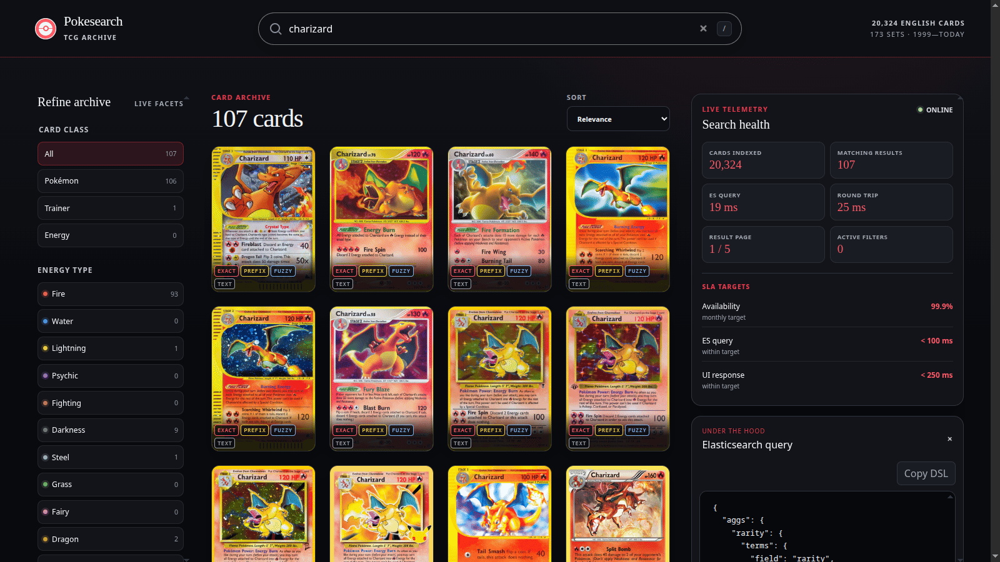
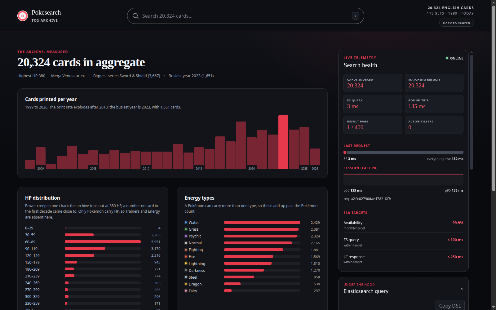
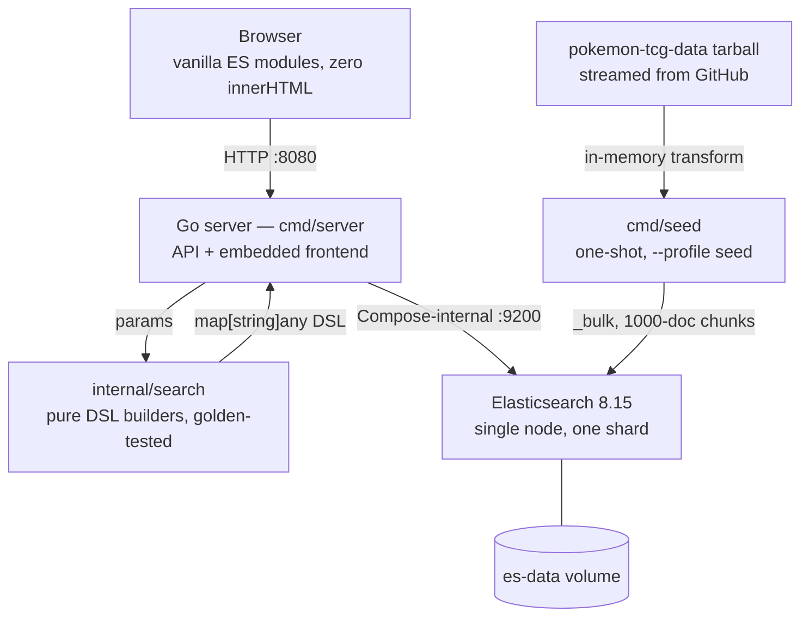

# Pokesearch

[](https://github.com/AndresThePerez/PokeSearch/actions/workflows/ci.yml)
[](go.mod)
[](LICENSE)

### **[Live demo → pokesearch.andrestheperez.com](https://pokesearch.andrestheperez.com)**

Pokesearch is a full-text search engine over all 20,324 English Pokémon TCG cards — a Go API, an Elasticsearch relevance model with disjunctive facets, and a dependency-free ES-module frontend, shipped as a single containerized binary. Searching the corpus is the easy half. The half worth reading the code for is that the engine explains itself.

Every result page carries an observability rail: the exact Elasticsearch DSL that answered the query, the cluster's own latency broken out from the browser round trip, a sparkline of the session's last twenty requests, and the live SLA targets — while the same query goes to the application log as one replayable JSON line tagged with the request ID printed on screen.

Relevance is equally legible. A text query fans into four *named*, boosted `should` branches; Elasticsearch echoes which branches each hit matched, so the grid renders them as per-card badges and the boost hierarchy becomes something you can watch shift down the page. `GET /api/explain` takes it one card deeper through Lucene's `_explain`, and because a `should` query's clauses sum, the modal's score bars add back up to the number the card was ranked by. The treatment generalizes: `#stats` profiles the entire archive in hand-rolled CSS charts and shows the aggregation DSL behind them in the same inspector.



## Quick start

```bash
docker compose up -d --build
docker compose --profile seed run --rm seed
curl -s http://localhost:8080/healthz
```

Open <http://localhost:8080>. The first seed streams the source tarball through memory and indexes 20,324 cards; it never writes them to disk. Elasticsearch stays private to the Compose network — only the application is published.

Publish on a different host port with `APP_PORT`:

```bash
APP_PORT=8081 docker compose up -d --build
```


## Development

The Go server defaults to `PORT=8080` and `ES_URL=http://127.0.0.1:9200`. Opt into a host-published development Elasticsearch with:

```bash
docker compose -f docker-compose.yml -f docker-compose.dev.yml up -d es
go run ./cmd/seed
PORT=8080 go run ./cmd/server
```

`docker-compose.dev.yml` binds Elasticsearch to `127.0.0.1:9200` only — never `0.0.0.0`.

The seed command accepts:

- `-es URL` — Elasticsearch URL. Defaults to `http://127.0.0.1:9200`.
- `-ref REF` — `AndresThePerez/pokemon-tcg-data` Git ref; defaults to `master`. Pin a commit SHA when a reproducible corpus snapshot matters.
- `-force` — delete and recreate a populated `cards` index.
- `-tarball-base URL` — source tarball base; defaults to the dataset's `codeload.github.com` path. Override it to seed from a mirror.

Run the checks the CI workflow runs:

```bash
go build ./...
go vet ./...
go vet -tags acceptance ./internal/acceptance
go test -race ./...
golangci-lint run
go run golang.org/x/vuln/cmd/govulncheck@latest ./...
find web -name '*.js' -exec node --check {} \;
```

CI adds one job this list cannot express locally: it builds the runtime image and asserts via `docker inspect` that it does not run as root.

In full, `.github/workflows/ci.yml` runs three jobs on every pull request and on every push to `master` — a Go job that builds, vets, vets the tag-gated `internal/acceptance` package separately so it cannot stop compiling unnoticed, runs the tests under `-race`, then runs golangci-lint at its pinned `v2.13.1` and `govulncheck` at a pinned version rather than the `@latest` above, so a newly published advisory cannot turn `master` red with no code change; a frontend job that runs `node --check` over every shipped `.js` file under `web/` and fails if that glob matches nothing; and the image job just described, whose assertion is stricter than its name — it fails if the configured user is empty as well as if it is `root`.

The acceptance suite is build-tagged and runs against a live stack:

```bash
POKESEARCH_URL=http://localhost:8080 go test -tags acceptance -count=1 ./internal/acceptance
```

`.github/workflows/acceptance.yml` runs that same suite end to end on demand (`workflow_dispatch`): it brings the stack up, seeds the pinned ref, asserts `/healthz` reports exactly 20,324 documents, and only then runs the tests.

### Build identity

Builds are stamped through `-ldflags` and reported by `/api/meta`. An unstamped build honestly reports `dev` / `none` / `unknown` rather than a misleading version:

```bash
VERSION=$(git describe --tags --always) \
COMMIT=$(git rev-parse --short HEAD) \
BUILT=$(date -u +%FT%TZ) \
docker compose up -d --build
```

## API

| Endpoint | Purpose | Parameters |
|---|---|---|
| `GET /` | The embedded frontend, served from `embed.FS` | — |
| `GET /livez` | Liveness only — never touches Elasticsearch. Container healthcheck target. | — |
| `GET /healthz` | Elasticsearch reachability and indexed document count | — |
| `GET /api/meta` | Build identity and corpus provenance | — |
| `GET /api/search` | Fuzzy multi-field card search, filters, facets, sorting, pagination | `q`, `id`, `supertype`, `types`, `set`, `rarity`, `series`, `hp_min`, `hp_max`, `sort`, `order`, `page`, `page_size`, `debug=1` |
| `GET /api/suggest` | Deduplicated card-name completion with a fuzzy retry | `q` |
| `GET /api/explain` | Score anatomy for one card under one query: per-branch contributions | `id`, `q` (both required) |
| `GET /api/stats` | Corpus analytics: prints per year, HP distribution, type/class/rarity/series breakdowns, max HP | `debug=1` |
| `GET /debug/vars` | expvar counters. **Opt-in** — only exists when `METRICS=1` | — |

Routes are registered with method-scoped patterns, so a `POST` to a `GET` route returns `405`, not `404`.

Search responses carry Elasticsearch's `took_ms`, the effective `page_size`, and live `supertype`, `types`, `rarity`, `set_series`, and readable `sets` facets. The `set` parameter takes an exact set ID; combine it with `q` to search within that set. Add `debug=1` to receive the generated DSL in the response.

`GET /healthz` returns `{"docs":N,"status":"ok"}`. Its shape and its Elasticsearch round-trip are a **frozen contract** — use `/livez` for cheap liveness.

`GET /api/meta` returns build identity plus corpus provenance:

```json
{
  "version": "v1.3.0",
  "commit": "4581829",
  "built": "2026-08-22T19:21:13Z",
  "docs": 20324,
  "seed": { "ref": "0af6250a22495e4a3e9f60ff45fc3fedc2e0563d", "seeded_at": "2026-08-22T19:40:00Z" },
  "request_id": "3f2a8c1d9e0b4a76"
}
```

`seed` is `null` for an index seeded before provenance stamping existed. That is reported, not repaired: the stamp appears on the index's next reseed.

### Corpus analytics

`GET /api/stats` aggregates the whole archive in a single `size: 0` request — a `date_histogram` of prints per year, a 30-point HP histogram, the four categorical breakdowns (read from the same facet registry the filter rail uses) and the corpus maximum HP. The corpus is immutable between reseeds, so the result is computed on the first request and served from memory afterwards; an empty index is served but never cached, so the first request after a seed heals it without a restart. `took_ms` is therefore the Elasticsearch time of the aggregation that produced the payload, not of the request being answered.

The `#stats` view renders that payload in hand-rolled CSS charts — no charting library — and the observability rail stays attached, so the aggregation DSL is one click away from the numbers it produced:



### Relevance design

A text query becomes four scored `should` branches. The boosts encode an *ordering* — exact beats prefix beats typo beats card text — and a 27-point sweep over the judged set of [ADR 9](docs/DECISIONS.md#adr-9--how-relevance-is-evaluated) kept that ordering while halving two of the sizes inside it. The **Measured** column is what the sweep found, and [ADR 10](docs/DECISIONS.md#adr-10--measured-branch-weights) is the record:

| Branch | Query | Boost | Measured | What it is for |
|---|---|---|---|---|
| `exact` | `term` on `name.kw` | **8** | Inert from 4 to 16 — every metric identical to the last digit, so the sweep gives no reason to move it | An exact name always wins. Searching "Pikachu" must not rank a Pikachu-adjacent card first. |
| `prefix` | `multi_match` `bool_prefix` over `name.sayt` + 2/3-grams | **2** | Swept over 2 / 4 / 8; **2** won, halving the old 4 | Instant as-you-type matching, so partial names still rank highly. |
| `fuzzy-name` | `match` on `name`, `fuzziness: AUTO` | **1.5** | Swept over 1.5 / 3 / 6; **1.5** won, halving the old 3 | Typo tolerance — "pikuchu" finds Pikachu — ranked below a real prefix match. |
| `text` | `multi_match` `best_fields` over attack/ability names and text, flavor text, set name, artist | *implicit 1* | Not swept — it is the unit the other three are ratios of, so moving it would only rescale them | Discovery through card text: "flip a coin" finds cards by what they do. |

The numbers behind that column — the metric table overall and per stratum, where the judgments came from, the queries the adopted weights moved, and the command that reproduces the run — are published in [docs/RELEVANCE.md](docs/RELEVANCE.md).

The four branch names are a contract, not a comment. Elasticsearch echoes the ones each hit matched (`matched_queries`), so a text search's response carries a `matched` array aligned index-for-index with `results` — the grid renders them as per-card badges, and the boost hierarchy becomes observable: sort by relevance and watch the badge mix shift down the page. `GET /api/explain?id=…&q=…` takes the same question one card deeper, replaying each branch against that single document through Elasticsearch's `_explain` and reporting what each contributed. A `should` query's clauses sum, so the matched branches add back up to the score the card was ranked by — which is what the modal's score bars draw. It is deliberately on demand and single-document: Lucene explain on 24 hits per keystroke is pure waste. One case is worth pre-empting, because it can read as a broken badge strip: on an exact-name query the mix does not shift at the top of the list at all — `q=charizard` returns `["exact","prefix","fuzzy-name","text"]` for each of the first three hits, because a name typed exactly satisfies all four branches at once. What separates those hits there is not which badges they carry but how much each branch contributed — the per-branch **scores**, one click away in the explain modal.

A text query also carries `highlights` (aligned the same way) and, when it found nothing, `did_you_mean`. Highlighting is on by default because it answers the question the reader actually asked — *why is this card in my results?* — and the fragments are `<mark>`-tagged server-side over card names, attack and ability names and text, and flavor text. The highlighter runs against its own non-fuzzy `highlight_query`: rewriting the ranking query's `fuzziness: AUTO` per document and per field costs 409 ms on this corpus against 20 ms for the scoped query, so ranking and marking are deliberately two different questions. The cost of that trade is exact and small — a card matched only by a typo still ranks, it just gets no snippet. `did_you_mean` comes from a term suggester that runs only on a zero-result text search: the cheapest response shape there is, and the one moment a correction cannot compete with the autocomplete the reader was already being offered. That gate is narrower than it reads, because the suggester competes with the edit budget the `fuzzy-name` and `text` branches already spend as `fuzziness: AUTO`: a typo those branches can still reach returns hits, which suppresses the suggestion, and a query mangled past every budget returns neither hits nor a correction — `q=charizzzard` answers **107** hits with no `did_you_mean`, and `q=zzzzqqqq` answers **0** hits, also with no `did_you_mean`. A correction fires in the gap between the two budgets, and the gap exists because they are shaped differently: `fuzziness: AUTO` scales with term length — no edits below three characters, one at three to five, two at six and up — while the term suggester sets no `max_edits` and so takes Elasticsearch's flat default of two at any length. So `q=eevio` — five characters, two edits from `Eevee` — is a single token the branches cannot reach and the suggester can: **0** hits carrying `did_you_mean: eevee`. Token count is not what decides it: `q=pikchu zzzzqqqq` puts one badly mangled token beside one the branches can still reach, and that reachable token alone brings back **267** hits, so the zero-result gate never opens and no correction is offered.

Filters (`supertype`, `types`, `rarity`, `set_series`, `set_id`, HP range) are scoring-neutral. With `q` empty there is nothing meaningful to score, so browse mode sorts by release date instead — match-all scores are noise, and asking for `sort=relevance` without a query is silently downgraded to `newest` rather than rejected. Every sort appends ascending card ID as a deterministic tiebreaker, which is what keeps page boundaries stable.

Facets are **disjunctive**: each one is computed with every active filter *except its own*, so selecting `Rare` does not collapse the rarity dropdown to `Rare`, and the count next to an option predicts what clicking it will do. See [ADR 3](docs/DECISIONS.md#adr-3--disjunctive-facets-via-post_filter).

#### Scoring model and analysis

Underneath those boosts the ranking is **stock BM25** — Elasticsearch's default similarity with default `k1` and `b`, and no `similarity` override anywhere in the mapping. That is a decision, not an omission. What decides a match here is short name fields over a small corpus that is immutable between reseeds, which is the shape BM25's defaults already fit, and nothing has been measured that would justify moving term saturation or length normalization off them. Retuning a similarity with no judgement set to score the change against is guessing with extra steps.

The analysis chain is deliberately just as plain. Every `text` field — `name`, `evolves_from`, `artist`, `set_name`, attack and ability names and text, and `flavor_text` — uses the **standard analyzer**; the index defines no custom analyzer at all. The one thing the settings do add is a lowercase normalizer, `lc`, applied to exactly four keyword sub-fields: `name.kw`, `evolves_from.kw`, `artist.kw` and `set_name.kw`. Those four are the ones a human types, so case must not decide the match. The bare keyword fields behind the filter rail — `supertype`, `subtypes`, `types`, `rarity`, `set_id`, `set_series` — get no normalizer on purpose: their values are a closed vocabulary the facets hand back to the client, which then sends them back verbatim, so folding case there would buy nothing and could merge two values the aggregation counts apart.

`name` carries three sub-fields, and each is a different Elasticsearch feature rather than a second copy of the same text. `name.kw` is the lowercase-normalized keyword the `exact` branch runs its `term` against. `name.sayt` is a **`search_as_you_type`** field, and the `_2gram` and `_3gram` sub-fields it generates are what the `prefix` branch's `bool_prefix` actually matches. `name.suggest` is a **completion suggester**, which Elasticsearch holds in memory as an FST — that is what makes `/api/suggest` cheap enough to fire on every keystroke. The API table above says what that endpoint does; this is the feature vocabulary behind it.

What the chain does *not* have is `asciifolding`, and the corpus's own name is where that shows: `q=pokemon` returns **13,386** hits while `q=pokémon` returns **13,564** — a gap of **178** documents on the word the archive is named after. The unaccented spelling is not lost, but it is carried by the wrong branch. With nothing folding `é` to `e`, no indexed token starts with `pokemon`, so the ASCII query cannot match `prefix` at all and its hits come back matched on `fuzzy-name` alone, a boost tier below the accented query, which matches both. Closing that means adding `asciifolding` to the analysis chain, and analysis lives in the mapping, so it needs a reindex — which on this project is the coordinated two-project change described in [ADR 8](docs/DECISIONS.md#adr-8--what-was-deliberately-not-built), because the companion load generator's fixtures assert exact corpus cardinalities. So folding waits for that reindex, and the divergence is written down here with its numbers rather than left for a reader to trip over.

That reindex now has a **measured** answer waiting for it. `cards_v2` is a shadow index — the same 20,324 documents, built by `_reindex` from `cards` — carrying a real analysis chain on `name`: a standard tokenizer, then `lowercase`, `asciifolding`, a small `gx, ex` suffix synonym group, a `word_delimiter_graph` and `flatten_graph`; the `lc` normalizer folds there too, so `name.kw` and the three other normalized keywords fold with it. **It is not what the live deployment serves.** Nothing aliases it, the server compiles `cards` in as its index name, and `/healthz`, every facet cardinality and every acceptance fixture still describe `cards` exactly as they did. The served chain has no folding; this paragraph is about a second index that does, and it exists so the paragraph above can be measured instead of asserted.

What the chain changes, in tokens — one hyphenated name and one accented one, each read back from that index's own `name` field with `_analyze`:

| Name | `cards` (served) | `cards_v2` (shadow) |
|---|---|---|
| `Ethan's Ho-Oh ex` | `["ethan's","ho","oh","ex"]` | `["ethan's","ethan","ho","oh","ex","gx"]` |
| `Pokémon Center Lady` | `["pokémon","center","lady"]` | `["pokemon","center","lady"]` |

The hyphen was never the problem: the standard tokenizer already split `Ho-Oh`. What the chain adds is the possessive stem (`ethan's` keeps its original token and gains `ethan`), the suffix synonym (`ex` and `gx` reach one another), and the fold. The fold is the headline, and it is a count rather than an argument — a bare `match` against the `name` field alone, no other branch involved, returns **0** documents for `pokemon` on `cards` and **71** on `cards_v2`, while `pokémon` returns **71** on both. On the served index the two spellings are two different terms; on the shadow index they are one term, and `name.kw` folds with them (`["pokémon center lady"]` becomes `["pokemon center lady"]`).

Scored against the judged set of [ADR 9](docs/DECISIONS.md#adr-9--how-relevance-is-evaluated), at the weights of [ADR 10](docs/DECISIONS.md#adr-10--measured-branch-weights), with the same `BuildQuery` and the same window on both sides, the shadow chain is **slightly worse overall**: nDCG@10 **0.645359 → 0.637366**. Four of the fifty judged queries moved, and none of them moved because of the accent. [ADR 11](docs/DECISIONS.md#adr-11--a-shadow-analyzer-index-measured-not-adopted) carries the per-stratum table and names the two mechanisms; both runs are checked in side by side as `docs/relevance/baseline.json` and `docs/relevance/baseline-v2.json`.

### Paging

`page_size` is bounded **1–100** and defaults to **24**. Pagination is capped at a reachable window of **9,600 documents** so `from + size` always stays inside Elasticsearch's 10,000-result window:

```text
pages = ceil(min(total, 9600) / page_size)
```

`pages` is therefore deliberately **not** `total / page_size` on large result sets: a browse of all 20,324 cards reports `pages: 400` at the default size, `96` at `page_size=100`, and `9600` at `page_size=1`. Out-of-range values clamp rather than fail — `page_size=500` becomes `100`, `page=999999` becomes the last reachable page.

### Errors

Every non-2xx **JSON API** response uses one shape:

```json
{
  "error": { "code": "invalid_param", "field": "sort", "message": "sort must be one of relevance|newest|oldest|hp|name" },
  "request_id": "3f2a8c1d9e0b4a76"
}
```

| Code | Status | Meaning |
|---|---|---|
| `invalid_param` | `400` | A strict parameter was supplied with an invalid value, or a required one (`/api/explain`'s `id` and `q`) was omitted. `field` names it. |
| `es_unavailable` | `503` | Elasticsearch could not be reached or returned an error. The cause — including a truncated Elasticsearch error body — goes to the log, never to the client. |

Two responses sit outside the envelope by design: `/healthz` answers a failed probe with its own frozen `{"status":"error"}` body, because a health endpoint's shape must never change, and the static file handler returns net/http's plain-text `404` for unknown asset paths.

Parameters split into two groups:

| Behaviour | Parameters | On invalid input |
|---|---|---|
| **Strict** | `sort`, `order`, `supertype`, `hp_min`, `hp_max`, `page`, `page_size` | `400` with the offending `field`. Rejected before Elasticsearch is called. |
| **Lenient** | members of the `types`, `rarity`, and `series` comma-lists; unknown query keys | Silently dropped/ignored, `200`. |

Out-of-range integers are clamped, not rejected — a clamp is a contract, an alphabetic `page` is a typo. `GET /api/suggest` reads only `q`, so field errors on its other parameters are ignored rather than returned. The rationale is [ADR 7](docs/DECISIONS.md#adr-7--a-strictlenient-error-contract).

Case is handled unevenly across those filters, and that is a known asymmetry rather than a design. `supertype` is lower-cased before it is matched against `pokemon|trainer|energy`, and `types` members are compared case-insensitively against the eleven canonical type names — but `rarity` and `series` members are only trimmed and then matched verbatim against bare keyword fields that carry no normalizer. So `rarity=common` answers `200` with a total of **0**, while `rarity=Common` returns **5,297**. Send those two the way the facets hand them back: title-case rarities (`Common`, `Uncommon`, `Rare Holo`) and full series names (`Sword & Shield`, `Scarlet & Violet`). Treat that as the interim contract — closing the gap either changes observable filter semantics or means a mapping change and therefore a reseed, so it is written down here rather than quietly altered.

### Type names

The API and index retain the source dataset's canonical TCG type values. The interface presents `Metal` as **Steel** and `Colorless` as **Normal**, including filter labels, active-filter chips, attack costs, card details, and the `#stats` chart labels.

### Card images

Card art is served from `images.scrydex.com`. The index and the API keep the source dataset's original `images.pokemontcg.io` URLs verbatim; the **frontend** rewrites them to Scrydex card-ID routes at render time, because the original URLs return real 404s. Keeping the rewrite at the presentation layer means the stored documents stay faithful to their source and a future art host is a one-function change. This is a hard third-party dependency: if Scrydex is unavailable, art fails to load while search itself continues to work.

## Observability

Every request gets an ID and leaves a trail that connects the browser to the log:

- **`X-Request-Id` on every response.** An inbound `X-Request-Id` or Cloudflare `Cf-Ray` is honoured so one trace spans edge, app and client; otherwise one is generated. An inbound value that does not look like a trace ID is replaced rather than sanitized — it ends up in a response header and in every log line.
- **One access line per request:** `method`, `path`, `status`, `bytes`, `dur_ms`, `request_id`.
- **One query line per search or suggestion** that reaches Elasticsearch, carrying the full generated DSL — the same query the UI's inspector shows. Both lines are JSON, both use UTC millisecond timestamps, and both name the same `request_id`, so correlating them never involves reasoning about time zones.
- **`METRICS=1`** publishes stdlib `expvar` counters at `/debug/vars`, keyed by route and status (`search_200`, `search_400`, …). Counting is always on; publishing is opt-in, because the production tunnel forwards whatever path it is given. **Never set `METRICS=1` in the server topology.**

**[Courier](https://github.com/AndresThePerez/Courier)** — the companion API test runner and load tester, [live at courier.andrestheperez.com](https://courier.andrestheperez.com) — drives this API on the deploy host over the internal container network, so the knee it reports is a property of **this** service rather than of the tool: throughput bends at about **10 workers**, **154.1 req/s** at a p50 of **70.36 ms** and a p95 of **118.80 ms**, **0.00%** errors, against a p95 target of **150 ms**. Past that point the extra concurrency queues rather than works, and the error rate never leaves zero. The SLA targets the rail shows are calibrated to those runs, which makes the service level on screen a measured one rather than an asserted one.

## Architecture



```text
browser :8080
     │
     ▼
Go server ── embedded HTML/CSS/JS
     │
     │ Compose-internal HTTP :9200
     ▼
Elasticsearch 8.15 ── es-data volume
     ▲
     │ one-shot /seed profile
pokemon-tcg-data tarball (streamed from GitHub)
```

The production Compose topology publishes only the Go application. `docker-compose.dev.yml` is deliberately opt-in so a plain `docker compose up` never exposes Elasticsearch on the host.

Elasticsearch runs `docker.elastic.co/elasticsearch/elasticsearch:8.15.0` as a single node with a 512m JVM heap. The runtime image is `gcr.io/distroless/static-debian12:nonroot` — no shell, no package manager, running as uid 65532, with both build and runtime base images pinned by digest. Because there is no shell, the server binary is its own healthcheck client (`/server -ping`).

**Why any of this is the way it is:** [docs/DECISIONS.md](docs/DECISIONS.md).

## Deployment

The stack is deployed by pulling the repository onto a host and building there. Substitute your own values:

| Variable | Example | Meaning |
|---|---|---|
| `DEPLOY_HOST` | `user@server` | SSH target running Docker |
| `DEPLOY_DIR` | `~/apps/pokesearch` | Checkout location on that host |
| `APP_PORT` | `8083` | Host port to publish the application on (defaults to `8080`) |
| `SEED_REF` | `0af6250a…` | `pokemon-tcg-data` commit to index |

```bash
ssh "$DEPLOY_HOST"
cd "$DEPLOY_DIR"
git pull
printf 'APP_PORT=%s\n' "$APP_PORT" > .env      # git-ignored
docker compose -f docker-compose.yml -f docker-compose.server.yml up -d --build
```

`docker-compose.server.yml` adds `restart: unless-stopped` and memory caps (`es` 1g — twice the 512m JVM heap, per Elastic's container guidance; `app` 256m) so the stack coexists with a host's other tenants. Elasticsearch remains on the Compose-internal network with no host port in any topology.

Never edit the deployed clone in place: commit on a workstation, push, pull on the host.

**Concrete instance.** The public deployment runs on a home server in `~/apps/pokesearch`, published on host port **8083** and exposed at <https://pokesearch.andrestheperez.com> through the host's existing Cloudflare Tunnel — one ingress rule above the 404 catch-all. Wildcard DNS already routes the subdomain, so no DNS change is involved. The same tunnel serves other production sites; regression-check them all after any config change.

### Seeding

Seed once per environment, pinned for reproducibility:

```bash
docker compose -f docker-compose.yml -f docker-compose.server.yml --profile seed run --rm seed \
  -es http://es:9200 -ref "$SEED_REF"
```

`0af6250a22495e4a3e9f60ff45fc3fedc2e0563d` is the `pokemon-tcg-data` `master` commit as of 2026-07-10 and yields exactly **20,324** documents (`/healthz` → `{"docs":20324,"status":"ok"}`). It is the ref pinned in `docker-compose.yml`. A populated index makes reseeding a no-op unless `-force` is passed.

### Backup and restore

The index is write-once: one verified backup after seeding is sufficient (no cron). All commands run on the deployment host in `$DEPLOY_DIR`.

Backup (≈30s downtime; the tarball is ~7MB):

```bash
mkdir -p ~/backups
docker compose -f docker-compose.yml -f docker-compose.server.yml stop es
docker run --rm -v pokesearch_es-data:/data -v ~/backups:/out alpine \
  tar czf /out/pokesearch-es-data-$(date +%F).tgz -C /data .
docker compose -f docker-compose.yml -f docker-compose.server.yml start es
```

Restore (into the live volume — stop the stack first):

```bash
docker compose -f docker-compose.yml -f docker-compose.server.yml stop es app
docker run --rm -v pokesearch_es-data:/data -v ~/backups:/in alpine \
  sh -c 'rm -rf /data/* && tar xzf /in/pokesearch-es-data-<DATE>.tgz -C /data'
docker compose -f docker-compose.yml -f docker-compose.server.yml start es app
```

Recovery ladder, cheapest first:

1. **Container restart** — the `es-data` volume persists the index.
2. **Reseed** with the pinned ref (see Seeding above) — deterministic, takes seconds.
3. **Restore** the backup tarball into `pokesearch_es-data` (commands above).
4. **Full rebuild** — re-clone, `up -d --build`, reseed.

Rollback for public exposure: restore the previous `cloudflared` config backup over the live config, restart `cloudflared`, then re-verify every hostname the tunnel serves.

## License

[MIT](LICENSE) © 2026 Andres Perez.

Pokémon and Pokémon character names are trademarks of Nintendo, Creatures Inc., and GAME FREAK inc. Card data comes from the `pokemon-tcg-data` dataset. This project is unaffiliated with those companies and is non-commercial.
